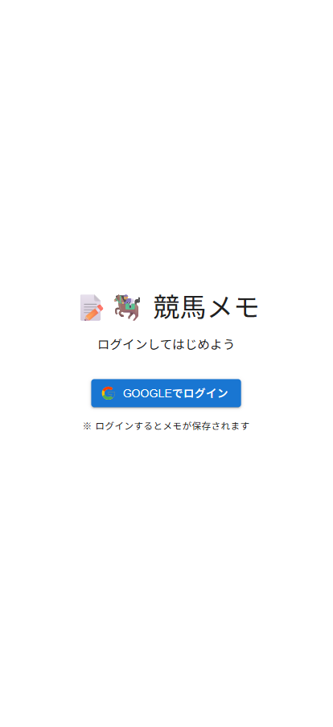
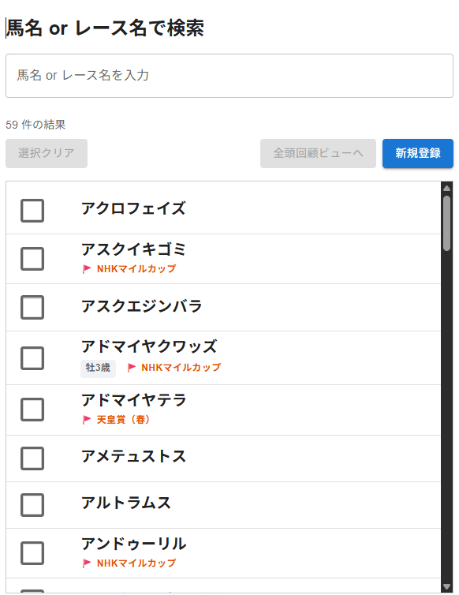
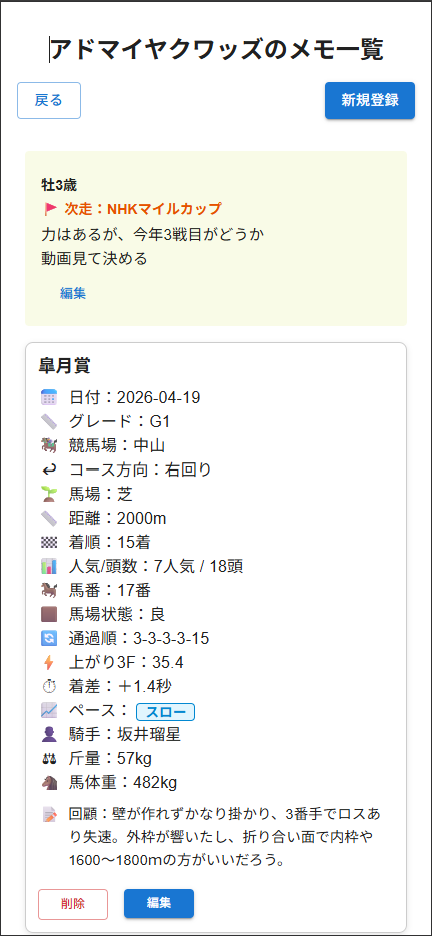
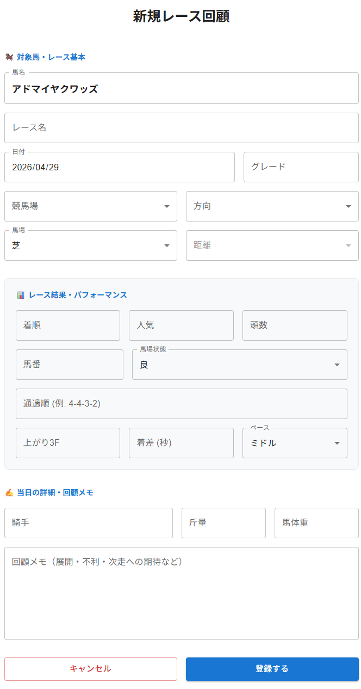
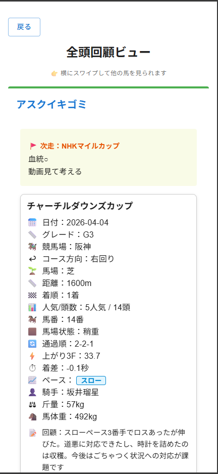

# MY-MEMO-APP


## 📌 概要
MY-MEMO-APPは、競馬ファンのためのレースメモ管理アプリです。  
ユーザーはGoogleアカウントでログインし、気になる競走馬のレース結果を記録・管理できます。

主な機能としては、馬名検索によるメモの絞り込み、個別の馬に対するレース回顧メモの作成・編集・削除。  
複数の馬に対する回顧を一覧表示する「全頭回顧ビュー」などを備えています。
次走用のメモも記録が可能です。

また、Firebase Authenticationによるログイン管理やFirestoreを用いたデータ保存、  
MUIを使ったUI設計など、モダンな技術スタックで構築されています。

## ✨ 主な機能

- 🔐 Googleログイン機能  
  Firebase Authenticationを使用したGoogleアカウントによるログイン機能。

- 🔍 馬名 or レース名検索機能  
  馬名 or レース名を入力して、該当する競走馬のメモを検索・表示。

- 📝 メモの作成・編集・削除  
  各競走馬に対して、レース回顧メモと次走メモを記録・管理可能。

- 📋 マイページ機能  
  自分が作成したメモを一覧で確認・編集・削除できるマイページ。

- 🐎 全頭回顧ビュー  
  複数の馬を選択して、それぞれのメモを横並びで比較・閲覧できるビュー。

- 🧠 Firebaseによるデータ管理  
  Firestoreを用いたリアルタイムなデータ保存と取得。

- 🎨 MUIによるUI設計  
  MaterialUIを活用した、見やすく使いやすいインターフェース。


## 🖼️ スクリーンショット

### 🔐 ログイン画面

Googleアカウントでログインする画面

### 🔍 検索画面

馬名 or レース名を入力して、該当する競走馬のメモを検索・表示

### 🐎 メモ一覧画面

選択した馬のレース回顧メモを一覧表示

### 📝 メモ作成画面

新規登録or編集時のフォーマット

### 📋 全頭回顧ビュー

複数の馬のレース回顧メモを横並びで比較・閲覧


## 🚀 セットアップ手順

1. このリポジトリをクローンします：

```bash
git clone https://github.com/takabekt/my-memo-app.git
cd my-memo-app
```

2. パッケージをインストールします：

```bash
npm install
```

3. 開発サーバーを起動します：

```bash
npm run dev
```

4. ブラウザで以下のURLにアクセスします

```bash
http://localhost:3000
```

5. Firebaseの設定情報を.env.localに記述してください：

```bash
NEXT_PUBLIC_FIREBASE_API_KEY=your_api_key
NEXT_PUBLIC_FIREBASE_AUTH_DOMAIN=your_auth_domain
NEXT_PUBLIC_FIREBASE_PROJECT_ID=your_project_id
NEXT_PUBLIC_FIREBASE_STORAGE_BUCKET=your_storage_bucket
NEXT_PUBLIC_FIREBASE_MESSAGING_SENDER_ID=your_sender_id
NEXT_PUBLIC_FIREBASE_APP_ID=your_app_id
```
※ .env.local は Git にコミットしないように .gitignore に追加されています。

## 🛠️ 使用技術

- Next.js 14  
  アプリケーションのフロントエンドおよびルーティングに使用。

- TypeScript  
  型安全な開発を実現するために使用。

- Firebase  
  - Authentication：Googleアカウントによるログイン認証  
  - Firestore：メモデータの保存・取得  
  - セキュリティルールの設定によるアクセス制御

- Vercel  
  GitHubと連携し、自動デプロイによるホスティングを実現。

- Material UI (MUI)  
  UIコンポーネントライブラリ。レスポンシブ対応やテーマ設計に使用。

- Git / GitHub  
  バージョン管理とソースコードのホスティングに使用。

- ESLint / Prettier  
  コードの品質維持と整形ルールの統一に使用。

## 📖 使い方
1. 競馬メモアプリにアクセスすると、Googleアカウントでのログイン画面が表示されます。
2. ログイン後、自分専用の検索画面に遷移します。
3. 「＋新規追加」ボタンから、馬ごとのレース回顧メモを作成できます。
4. 作成したメモは、一覧で確認・編集・削除が可能です。
   - 例：馬名・レース日・回顧コメントなどを入力
   - 次走メモ・馬番・性別・年齢を入力可能
5. 検索画面では、馬名 or レース名でメモを検索し、馬名をクリックすることでその馬のメモ一覧を表示できます。
   また、チェックボックスで複数の馬を選択して全頭回顧ビューを表示できます。
6. 全頭回顧ビューでは以下が可能です。
   - 選択した馬のメモを横スクロールで一括表示
   - 各馬名をクリックすると、その馬のメモ一覧ページに遷移
7. メモはFirestoreに保存され、ログインユーザーごとに管理されます。
8. スマートフォンからもアクセス可能で、レスポンシブ対応済みです。

## 📂 ディレクトリ構成

<pre><code>
my-memo-app/
├── public/                 # 公開用ファイル（画像、manifestなど）
├── src/
│   ├── app/                # Next.js App Router構成
│   │   ├── login/          # ログイン画面
│   │   ├── mypage/         # マイページ（一覧・新規登録・編集）
│   │   ├── search/         # 検索画面
│   │   ├── horse/          # 指定した馬のメモ一覧
│   │   └── review/         # 全頭回顧ビュー
│   ├── components/         # UIコンポーネント
│   ├── auth/               # 認証関連の処理
│   ├── form/               # フォーム関連
│   ├── memo/               # メモ表示関連
│   ├── hooks/              # カスタムフック
│   ├── utils/              # スタイルや共通関数
│   └── firebase.js         # Firebase初期化
├── .env.local              # 開発環境だけで使う、アプリの設定情報をまとめたファイル
├── next.config.js          # Next.js 設定ファイル
├── package.json            # 依存関係とスクリプト定義
└── README.md               # プロジェクト概要と使い方
</code></pre>
